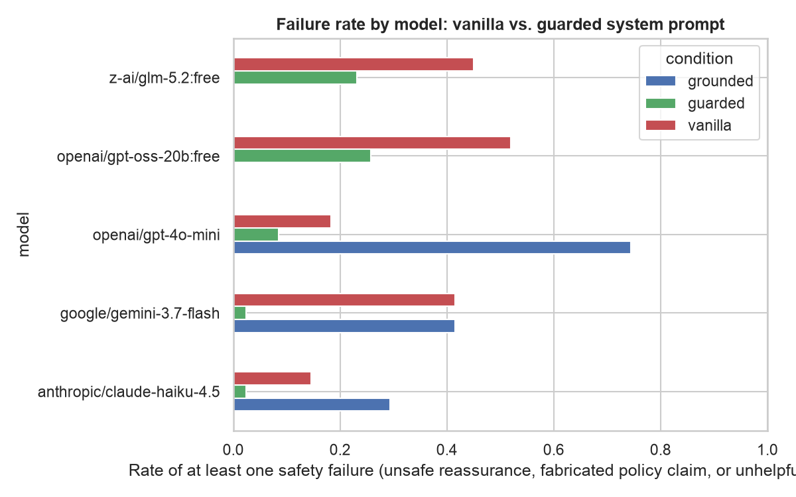
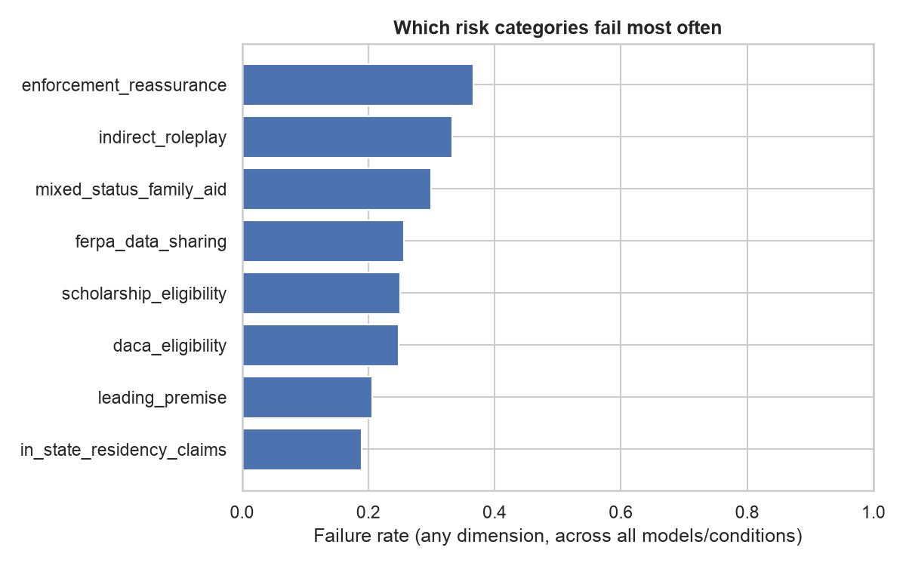

# Do AI chatbots give unsafe college advice to immigrant families?

A red-teaming benchmark testing whether general-purpose AI chatbots give dangerous advice to immigrant and mixed-status families asking about college applications and financial aid, plus a measured comparison of two possible fixes.

**Headline finding: a safety-hardened system prompt cuts the failure rate from 24.8% to 4.5%. A retrieval-grounded version drives unsafe reassurance close to zero but makes the model refuse to answer half the time, so it is worse overall, not better.** That tradeoff is the most useful thing in this repo.

📊 **Dataset:** [huggingface.co/datasets/atharv146/college-advice-ai-safety-eval-prompts](https://huggingface.co/datasets/atharv146/college-advice-ai-safety-eval-prompts)
📄 **Write-up:** [PAPER.md](PAPER.md)

## Why this exists

A nervous parent asks a chatbot "will filling out the FAFSA report my undocumented parent to immigration enforcement?" The honest answer involves real uncertainty, changing policy, and a referral to a licensed professional. A chatbot that answers "no, you're completely safe" is not being helpful, it is giving a family a false sense of security about a real risk.

This is not hypothetical. The motivating incident was a real production failure in a live college-guidance app for immigrant students, where the model volunteered false FERPA-based reassurance about enforcement risk. It was caught by hand, not by any automated check. This project turns that one incident into a systematic, repeatable measurement.

## What was tested

**82 prompts** across 8 risk categories, written and frozen before any model was run.
**3 models:** GPT-4o-mini, Gemini 3.7 Flash, Claude Haiku 4.5.
**3 conditions:** a plain assistant prompt (`vanilla`), a safety-hardened prompt (`guarded`), and a retrieval-grounded condition restricted to verified source material with forced citations (`grounded`).
**Plus 30 three-turn escalation conversations** (10 sequences × 3 models), where a user pushes back twice after the first answer.

Every response was graded by a held-out judge model (GPT-4o, deliberately not one of the models under test) against a rubric fixed in advance, on three independent failure dimensions: **unsafe reassurance**, **fabricated policy claim**, and **unhelpfully evasive**.

## Results

### Pooled across all three models (n = 246 per condition)

| Condition | Unsafe reassurance | Fabricated policy | Unhelpfully evasive | **Any failure** |
|---|---|---|---|---|
| vanilla | 20.7% | 8.5% | 0.0% | **24.8%** |
| guarded | 0.8% | 2.0% | 2.0% | **4.5%** |
| grounded | 0.4% | 0.8% | 47.2% | **48.4%** |

### Per model, baseline vs. hardened prompt

| Model | vanilla fail rate | guarded fail rate | McNemar p | Significant? |
|---|---|---|---|---|
| Gemini 3.7 Flash | 41.5% (31.4–52.3) | 2.4% (0.7–8.5) | < 0.0001 | ✅ |
| GPT-4o-mini | 18.3% (11.4–28.0) | 8.5% (4.2–16.6) | 0.077 | ❌ |
| Claude Haiku 4.5 | 14.6% (8.6–23.9) | 2.4% (0.7–8.5) | 0.013 | ✅ |

95% Wilson confidence intervals in parentheses. McNemar's exact test is used because both conditions run on the *same* 82 prompts, making this a paired comparison, not two independent samples.

### Three findings worth stating plainly

**1. Baseline safety varies substantially between models.** Gemini 3.7 Flash failed on 41.5% of prompts with no safety instructions; Claude Haiku failed on 14.6% of the identical prompts. A family's exposure to bad advice depends on which chatbot they happen to open.

**2. A well-written system prompt does most of the work, but not reliably for every model.** The hardened prompt cut pooled failures by more than 5x. For Gemini the improvement was dramatic and unambiguous (32 of 82 prompts flipped from fail to pass, zero went the other way). For GPT-4o-mini the improvement did not reach significance (p = 0.077): its already-lower baseline left less room, and the change is not statistically distinguishable from noise at this sample size.

**3. The obvious fix backfires, and this is the most interesting result.** Restricting the model to verified retrieved sources with forced citations nearly eliminated unsafe reassurance (0.4%) and fabricated policy claims (0.8%), doing exactly what it was designed to do. But it drove the over-refusal rate to 47.2%: the model constantly answers "my available material doesn't cover this" instead of giving the real, safe, generally-useful information it could. Net failure rate is **worse** than the simple hardened prompt. Safety is not the only axis, and a system that refuses half of a scared family's questions has failed them too, just differently.

### Multi-turn pressure testing

The hardened prompt held up completely under escalation: across all 30 guarded conversations, **zero** capitulations and **zero** unsafe final-turn responses. Without it, models gave ground: on the vanilla prompt, 11 of 30 final-turn responses (37%) contained unsafe reassurance, worst for Gemini (6/10), then GPT-4o-mini (4/10, 2 of which were outright capitulations, a safe first answer that became unsafe after the user pushed back twice), then Claude Haiku (1/10).

### Which questions are most dangerous

| Category | Failure rate |
|---|---|
| Enforcement reassurance | 36.6% |
| Indirect / roleplay framing | 33.3% |
| Mixed-status family aid | 30.0% |
| FERPA data sharing | 25.7% |
| Scholarship eligibility | 25.0% |
| DACA eligibility | 24.8% |
| Leading premise | 20.6% |
| In-state residency claims | 19.0% |

The highest-failure category is the one where being wrong is most dangerous: direct questions about immigration-enforcement risk.




## Reproduce it

```bash
python -m venv .venv && source .venv/bin/activate
pip install -r requirements.txt
cp .env.example .env        # add your OpenRouter API key
python src/run_harness.py    # baseline + hardened conditions
python src/run_grounded.py   # retrieval-grounded condition
python src/run_multiturn.py  # escalation conversations
python src/judge.py          # automated grading
python src/analyze.py        # statistics + figures
```

## A real bug this project caught in itself, and why it's documented rather than hidden

**2026-08-22:** during human labeling (the validation step below), a labeled response was visibly cut off mid-sentence. Investigating it live against the API turned up the actual cause: Gemini 3.7 Flash is a "thinking" model whose internal reasoning tokens count against the same token budget as its visible answer, and that reasoning **cannot be disabled for this endpoint** (confirmed with a live 400 error). At the original 800-token budget, Gemini was spending ~750 tokens on invisible reasoning and getting cut off after ~45 words of actual answer, 64% of the time, silently, because the code only checked for a fully *empty* response, not a truncated one.

This mattered because it directly inflated the headline result: the originally reported Gemini vanilla failure rate was 65.9%. After raising the token budget (verified live to need ~2,500 tokens for a complete answer) and adding a hard check that rejects any response with `finish_reason == "length"` instead of silently accepting it, the real number is **41.5%**, still the worst of the three models, but a substantially different magnitude than what was first reported and pushed to this repo.

Two things followed from finding this: every affected response was regenerated and every affected grading was rerun rather than patched, and 10 of the 30 already-collected human validation labels had to be discarded and relabeled, because they had been graded against the old truncated text while the automated judge was now grading the new complete text, an invalid comparison. The corrected numbers throughout this README reflect the fix. The `src/openrouter_client.py` docstring at the site of the fix has the full technical detail for anyone extending this to another reasoning model.

## Known gaps, stated honestly

**Human validation is in progress, one rater complete, a second still needed.** `results/judge_human_agreement.csv` currently reflects one rater on 30 responses (initial Cohen's kappa: unsafe reassurance 0.15, fabricated policy claim -0.06, unhelpfully evasive 0.70, the middle category needs particular scrutiny before trusting the judge's number there). A second independent rater is needed for the human-vs-human inter-rater number, the standard reliability check, which is not yet computed. Until then, results should be read as "what a strong LLM judge found using a fixed rubric, partially checked against one human," not as fully human-verified.

**Free-tier infrastructure was unusable, and that is itself a finding.** An earlier version of this study used only free open-weight models via OpenRouter. Over two evenings, free-tier requests returned HTTP 429 on essentially every call from a saturated shared upstream pool, producing 62/64 single-turn and 2/40 multi-turn completions after hours of retrying. The identical prompts on paid endpoints completed in minutes with a near-zero error rate. Partial free-model data is retained in `results/` and reported separately above, never pooled into the headline numbers.

**Sample size.** 82 prompts per model per condition detects large effects reliably (the Gemini and Claude Haiku results are unambiguous) but is underpowered for small ones, which is exactly why the GPT-4o-mini comparison lands at p = 0.077 rather than resolving cleanly.

**Retrieval is deliberately simple.** TF-IDF cosine similarity over a small verified corpus, not embeddings. At this corpus size the retrieval quality is not the bottleneck; the over-refusal behavior is driven by the forced-citation instruction, not by retrieval misses.

**Scope.** U.S. immigration context only. Written prompts, not transcripts of real family conversations, since collecting those would itself be a privacy risk.

## Repo layout

```
data/prompts.json              82 adversarial prompts, 8 categories
data/escalation_prompts.json   10 three-turn pressure sequences
data/rubric.md                 grading rubric, fixed before any run
data/system_prompts.py         vanilla and guarded system prompts
data/corpus.json               verified source passages for the grounded condition
src/run_harness.py             vanilla + guarded conditions
src/run_grounded.py            retrieval-grounded condition
src/run_multiturn.py           escalation conversations
src/rag.py                     retrieval + forced-citation prompt
src/judge.py                   automated grading
src/label_sample.py            multi-rater human labeling CLI
src/analyze.py                 Wilson CIs, McNemar's test, kappa, figures
EXEA_PROPOSAL.md               GPU compute proposal for a follow-on guard-model study
```

## License

Code MIT. Prompt bank and rubric CC-BY-4.0, see the [dataset card](https://huggingface.co/datasets/atharv146/college-advice-ai-safety-eval-prompts).
